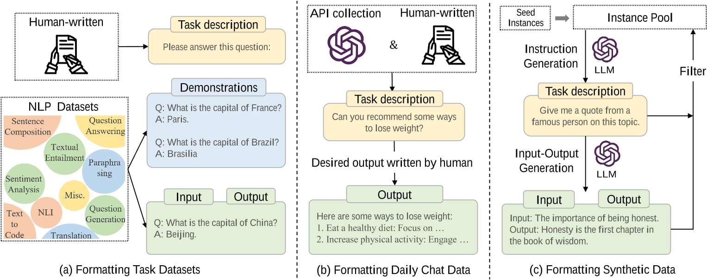
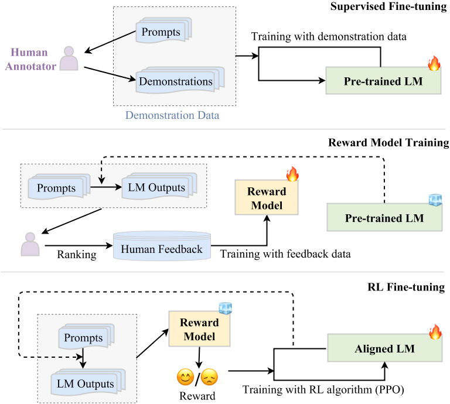
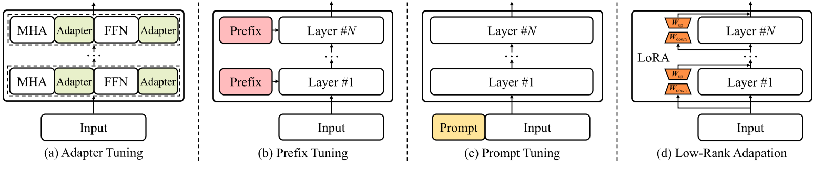

！！！这行不要删：请保留两级目录，使用（##）和（###）开头。

[toc]

## 三、大语言模型的适应性

​	经过预训练，LLMs可以获得解决各种任务的一般能力。然而，越来越多的研究表明，LLMs的能力可以根据具体目标进一步调整。在本节中，我们将介绍调整预训练LLMs的两种主要方法，即`instruction tuning`和`alignment tuning`。前一种方法旨在增强(或解锁)LLMs的能力，而后一种方法旨在使LLMs的行为与人类的价值观或偏好保持一致。此外，我们还将讨论资源有限环境下模型适应的有效调优和量化。接下来，我们将详细介绍这四个部分。

### 1. Instruction Tuning

​	本质上，instruction tuning是在自然语言形式的格式化实例集合上微调预先训练的LLMs的方法，这与监督微调和多任务提示训练高度相关。为了执行instruction tuning，我们首先需要收集或构造instruction-formatted的实例。然后，我们使用这些格式化的实例以监督学习的方式微调 LLMs（例如，使用序列到序列损失进行训练）。在instruction tuning之后，LLMs可以表现出泛化到未知任务的能力，即使在多语言环境中。

1. 格式化实例构造

   通常，一个instruction-formatted实例由任务描述（称为instruction）、可选输入、相应输出和少量演示（可选）组成。接下来，我们介绍了构建格式化实例的三种主要方法，然后讨论了实例构建的几个关键因素。

   

   
图1. 实例格式的说明和构造指令格式实例的三种不同方法

   - 格式化任务数据集

     ​	使用自然语言任务描述对这些多任务训练数据集进行格式化很方便。具体来说，最近的工作用人工编写的任务描述增强了标记数据集，从而指导 LLMs 通过解释任务目标来理解任务。例如，在问答任务中每个示例中都添加了一个任务描述“请回答这个问题”。通过在删除任务描述的标记数据集上微调模型，它会导致模型性能急剧下降，这表明instructions是 LLMs 的任务泛化能力的关键因素。为了丰富训练实例，一些研究也尝试使用专门设计的任务描述来反转现有实例的输入输出对以进行instruction tuning。例如，给定一个问答对，我们可以通过预测问题条件答案来创建一个新实例（例如，“请根据答案生成问题：”）。

   - 格式化每日聊天数据

     ​	尽管大量的训练实例已经用instruction进行了格式化，但它们主要来自公共的NLP数据集，要么缺乏instruction多样性，要么与人类的真实需求不匹配。为了克服这个问题，InstructGPT建议采用真实用户提交到OpenAI API的查询作为任务描述。为了丰富任务的多样性，还要求人工标注者为现实生活中的任务编写instructions，包括开放式生成、开放式问答、头脑风暴和聊天。然后，他们让另一组标注者直接回答这些instructions作为输出。最后，他们将一条instruction(即收集到的用户查询)和预期输出(即人工编写的答案)配对作为训练实例。

   - 格式化合成数据

     ​	为了减轻人工注释或手动收集的负担，已经提出了几种半自动化方法，通过将现有实例馈送到LLMs中来构建实例，以合成各种任务描述和实例。

   - 实例构建的关键因素

     - 缩放instructions。大量研究表明，扩展任务数量可以极大地增强LLMs的泛化能力。

     - 格式设计。

       作为一个重要因素，自然语言格式的设计也高度影响着LLMs的泛化性能。通常，我们可以在现有数据集的输入输出对中添加任务描述和可选演示，其中任务描述是LLMs理解任务的最关键部分。此外，通过使用适当数量的范例作为演示，它可以带来实质性的改进，这也减轻了模型对instruction工程的敏感性。

       最近，为了引出LLMs的分步推理能力，一些研究提出在一些推理数据集(如算术推理)中加入思维链(CoT)示例。研究表明，对带有CoT和非CoT示例的LLMs进行微调可以在各种推理任务中获得良好的性能，包括那些需要多跳推理能力的任务。

       总之，instructions的多样性和质量似乎比实例的数量更重要，因为性能良好的InstructGPT和Alpaca比flan系列LLMs使用更少但更多样化的instructions(或实例)。此外，邀请标注者来编写人类需要的任务比使用特定于数据集的任务更有用。

2. Instruction Tuning 策略

   与预训练不同，instruction tuning通常更有效，因为只使用适量的实例进行训练。由于instruction tuning可以被认为是一个有监督的训练过程，因此它的优化与预训练有几个方面的不同，例如训练目标(即序列到序列的损失)和优化配置(例如更小的批大小和学习率)，这些都需要在实践中特别注意。除了这些优化配置之外，还有两个重要的方面需要考虑:

   - 均衡数据分布。根据最近的研究结果，增加高质量集合(如FLAN和P3)的采样比例通常可以提高性能。
   - instruction tuning与预训练相结合。一些研究没有使用单独的两阶段过程(预训练然后instruction tuning)，而是尝试使用多任务学习，使用预训练数据(即纯文本)和instruction tuning数据(即格式化数据集)的混合从头开始训练模型。

3. Instruction Tuning的效果

   - 提高性能。尽管在适度数量的实例上进行了调优，但instruction tuning已经成为提高或解锁LLMs能力的重要方式。最近的研究对多个尺度(77M到540B)的语言模型进行了实验，结果表明，不同尺度的模型都可以从instruction tuning中受益，随着参数尺度的增加，性能得到提高。此外，具有instruction tuning的较小模型甚至可以比没有微调的较大模型表现得更好。除了模型规模之外，instruction tuning在各种模型架构、预训练目标和模型自适应方法上都有一致的改进。在实践中，instruction tuning提供了一种增强现有语言模型(包括小型PLMs)能力的通用方法。此外，它比预训练成本低得多，因为LLMs所需的instruction数据量明显小于预训练数据。
   - 任务泛化。大量的研究已经证实了instruction tuning的有效性，可以在可见任务和不可见任务上获得卓越的性能。此外，instruction tuning已被证明有助于缓解LLMs的几个弱点(例如，重复生成或补充输入而未完成某个任务)，从而使LLMs具有解决实际任务的卓越能力。此外，经过instruction tuning训练的LLMs推广到跨语言的相关任务。
   - 领域专业化。instruction tuning是使现有的通用LLMs成为特定领域专家的有效方法。

4. Instruction Tuning的实证分析

   使用不同instruction集的微调LLMs往往会导致在下游任务上具有不同性能的模型变体。我们总结了在现有工作中广泛使用的四种主要改进策略:

   - 提高instruction复杂度。正如已有研究所讨论的那样，提高instructions的复杂性可以提高LLMs遵循复杂instructions的模型能力，例如包括更多的任务需求或需要更多的推理步骤。
   - 增加话题的多样性。除了复杂性之外，提高instructions数据集的主题多样性有助于激发LLMs在现实世界中处理不同任务的不同能力。
   - 缩放instruction数。除了以上几个方面，instructions的数量也是可能影响模型性能的一个重要因素。
   - 平衡instruction难度。由于合成instructions往往包含过于简单或过于困难的instruction，这很可能导致LLMs的训练不稳定甚至过拟合。

   一些研究实验结果表明：

   - 任务格式的instruction更适合QA设置，但可能不适用于聊天设置。
   - 多种instructions形式的结合对提高LLMs的综合能力有很大的帮助。
   - 增强instruction的复杂性和多样性可以提高模型的性能。
   - 简单地增加instruction数量可能并不那么有用，平衡难度也并不总是有用的。在没有质量控制的情况下，单纯地增加合成instruction的数量可能无法有效地提高性能。

### 2. Alignment Tuning

​	本部分首先介绍了alignment的背景及其定义和标准，然后介绍了用于aligning LLMs的人类反馈数据的收集，最后讨论了用于alignment tuning的人类反馈强化学习(RLHF)的关键技术。

1. alignment背景和标准

   ​	LLMs在广泛的NLP任务中显示出卓越的能力。然而，这些模型有时可能会表现出意想不到的行为，例如，编造虚假信息，追求不准确的目标，并产生有害的、误导性的和有偏见的表达。对于LLMs，语言建模目标通过单词预测预训练模型参数，而不考虑人的价值观或偏好。为了避免这些意想不到的行为，人们提出了human alignment，使LLMs的行为符合人类的期望。

   ​	近年来，人们越来越关注制定各种标准来规范LLMs的行为。三个代表性的对齐标准：有益的、诚实的和无害的。这些标准在现有文献中被广泛采用。此外，LLMs还从行为、意图、激励和内在等不同角度提出了其他的对齐标准，这些标准与上述三个标准本质上相似(或至少具有相似的对齐技术)。

2. 收集人们的反馈

   ​	在预训练阶段，LLMs使用大规模语料库上的语言建模目标进行训练。然而，它不能考虑到人类对LLMs产出的主观和定性评价(在本文中称为人类反馈)。高质量的人类反馈对于使LLMs与人类的偏好和价值观保持一致非常重要。在现有的工作中，主要有三种方法来收集人类标注者的反馈和偏好数据。

   1. 在早期的工作中，人类标注者通常以粗粒度的方式评估模型生成的输出(即只选择最好的)，而不考虑更细粒度的对齐标准。尽管如此，不同的标注者可能对最佳候选输出的选择持有不同的意见，并且该方法忽略了未选择的样本，这可能导致不准确或不完整的人为反馈。
   2. 人类标注者可以通过回答研究人员设计的某些问题来提供更详细的反馈，这些问题涵盖了对齐标准以及LLMs的附加约束。特别是，在WebGPT中，为了帮助模型从检索到的文档中过滤和利用相关信息，需要人工标注者回答关于检索到的文档是否对回答给定输入有用的多个选项的问题。
   3. 许多研究还开发了基于规则的方法来提供更详细的人类反馈。作为一个典型案例，Sparrow不仅选择了标注者认为最好的响应，而且还使用一系列规则来测试模型生成的响应是否满足有益、正确和无害的对齐标准。

3. 基于人类反馈的强化学习

   ​	为了使LLMs与人类价值观保持一致，已经提出了基于人类反馈的强化学习(RLHF)，利用收集到的人类反馈数据对LLMs进行微调，这有助于提高对齐标准(例如，有用性、诚实性和无害性)。RLHF采用强化学习(RL)算法(例如，Proximal Policy Optimization (PPO))通过学习奖励模型使LLMs适应人类反馈。这种方法将人类纳入训练循环中，以开发对齐良好的LLMs，如InstructGPT所示。

   ​	RLHF系统主要由三个关键部分组成:一个预训练的LM，一个从人类反馈中学习的奖励模型，以及一个训练LM的RL算法。具体来说，预训练的LM通常是一个生成模型，使用现有的预训练的LM参数进行初始化。例如，OpenAI使用175B GPT-3作为其第一个流行的RLHF模型InstructGPT， DeepMind使用2800亿个参数模型Gopher作为其GopherCite模型。此外，奖励模型(RM)提供(学习到的)指导信号，这些信号反映了人类对LM生成的文本的偏好，通常以标量值的形式出现。奖励模型可以采取两种形式:微调的LM或使用人类偏好数据重新训练的LM。现有工作通常采用的奖励模型的参数尺度与对齐的LM不同。例如，OpenAI使用6B GPT-3, DeepMind使用7B Gopher作为奖励模型。最后，为了使用来自奖励模型的信号来优化预训练的LM，设计了一种用于大规模模型调谐的特定强化学习算法。具体来说，近端策略优化(Proximal Policy Optimization, PPO)是一种在现有工作中广泛使用的RL对齐算法。

   

   
图2. RLHF算法的工作流程

   RLHF的关键步骤：

   1. 监督微调。为了使LM最初执行所需的行为，它通常需要收集一个受监督的数据集，其中包含输入提示(Instruction )和用于微调LM的所需输出。
   2. 奖励模式训练。第二步是使用人类反馈数据来训练RM。具体来说，我们使用LM来生成一定数量的输出文本，使用采样提示(来自监督数据集或人工生成的提示)作为输入。然后，我们邀请人类标记员来注释这些对的偏好。注释过程可以有多种形式，常用的方法是通过对生成的候选文本进行排序来进行注释，这样可以减少注释者之间的不一致性。然后，训练RM来预测人类偏好的输出。在InstructGPT中，标签器将模型生成的输出从最好到最差排序，RM(即6B GPT-3)被训练来预测排名。
   3. RL微调。在这个步骤中，对齐(即微调)LM被形式化为RL问题。由于RL算法的不稳定性，最近的研究通过重用具有更高奖励的最佳排名样本，用另一种监督微调取代了RL调优。

### 3. 参数高效的模型适应

​	在上面，我们讨论了根据特定目标调整LLMs的instruction tuning和alignment tuning方法。由于LLMs由大量的模型参数组成，因此执行全参数调优的成本很高。在本节中，我们将讨论如何对LLMs进行有效的调优。在现有文献中，参数高效微调一直是一个重要的主题，旨在减少可训练参数的数量，同时尽可能保持良好的性能。我们简要回顾Transformer语言模型的四种参数高效的微调方法，包括适配器调优、前缀调优、提示调优和LoRA。

图3. 四种不同的参数有效微调方法。MHA和FFN分别表示Transformer层的多头注意网络和前馈网络。

1. 适配器调优将小型神经网络模块(称为适配器)集成到Transformer模型中。适配器模块将集成到每个Transformer层中，通常在Transformer层的两个核心部分(即注意层和前馈层)之后使用串行插入。在微调过程中，适配器模块将根据特定的任务目标进行优化，而原始语言模型的参数在此过程中被冻结。这样，我们可以在微调过程中有效地减少可训练参数的数量。
2. 前缀调优为语言模型中的每个Transformer层添加一系列前缀，这些前缀是一组可训练的连续向量。这些前缀向量是特定于任务的，可以将其视为虚拟令牌嵌入。由于只训练前缀参数，因此可以实现参数有效的模型优化。
3. 与前缀调优不同，提示调优主要侧重于在输入层加入可训练的提示向量。基于离散提示方法，它通过包括一组软提示令牌(自由形式或前缀形式)来增强输入文本，然后使用增强的提示输入来解决特定的下游任务。在训练过程中，根据特定任务的监督，只学习提示嵌入。
4. LoRA在每个密集层上施加低秩约束来逼近更新矩阵，从而减少可训练参数以适应下游任务。

​	LoRA已被广泛应用于开源llm(例如LLaMA和BLOOM)，用于参数高效的微调。在这些研究尝试中，LLaMA及其变体在参数高效调谐方面受到了广泛关注。例如，AlpacaLoRA已经使用LoRA作为Alpaca的轻量级调优版本进行了训练(一种经过微调的7B LLaMA模型，具有52K的人类指令演示)。有研究比较了四种有效的调优方法，包括串行适配器调优，并行适配器调优和LoRA，LoRA在这些比较方法中表现相对较好，使用的可训练参数明显较少。

​	作为一个重要的资源，库PEFT(代表参数高效微调)已经在GitHub32上发布。它包括几种广泛使用的高效调优方法，包括LoRA /AdaLoRA、prefixtuning、P-Tuning和prompt-tuning。此外，它支持许多语言模型，例如GPT-2和LLaMA，并且还涵盖了几个代表性的视觉Transformer模型(例如，ViT和Swin Transformer)。

### 4. 内存高效的模型适应

​	由于有大量的模型参数，LLMs需要占用大量的内存来进行推理，这使得在实际应用程序中部署LLMs的成本非常高。在本节中，我们将讨论如何通过流行的模型压缩方法(即模型量化)减少LLMs的内存占用，以便大型LLMs可以在资源有限的环境中使用，这也可能减少推理延迟。

​	通常有两种主要的模型量化方法，即`量化感知训练(QAT)`(需要额外的全模型再训练)和`训练后量化(PTQ)`(不需要模型再训练)。与小型语言模型相比，在设计或选择LLMs量化方法时需要考虑两个主要差异。首先，LLMs由大量参数组成，因此PTQ方法比QAT方法计算成本低得多，因此更受欢迎。其次，LLMs表现出非常不同的激活模式(即大的离群值特征)，并且LLMs的量化变得更加困难，特别是隐藏激活。

一些LLMs的PTQ方法：

- Mixed-precision分解（Mixed-precision decomposition）。
- 细粒度的量子化（Fine-grained quantization）。
- 平衡量化难度（Balancing the quantization difficulty）。
- Layerwise量子化（Layerwise quantization）。

其他量化方法：

- 高效微调增强量化（Efficient fine-tuning enhanced quantization）。
- LLMs量化意识培训(QAT)（Quantization-aware training (QAT) for LLMs）。

## 四、大模型的使用

### In-Context Learning

ICL的形式如上图，由三个部分组成：任务描述，若干个问答的示例（demonstration）和一个query

ICL与前文提及的指令微调，都采用了自然语言的形式来描述任务和实例，区别在于后者是为了适配模型，前者仅在使用阶段提示LLM

ICL的性能很大程度上依赖于示例，所以设计合适的示例至关重要，这包含以下三个方面：
- 示例选择：通常采用简单且低开销的启发式方法，比如基于k-NN检索与query语义相关的示例、选择最具代表性的示例集合

- 示例格式：一些研究考虑添加任务描述，或者通过 CoT 提示来构建模板

- 示例顺序：LLM会倾向于重复示范结尾的答案 。早期工作提出了一些启发式方法来快速地找到一个良好的顺序

关于LLM如何实现ICL：
- 一种观点认为，LLM主要是从示例中识别出目标任务而非从中学习。也就是说，LLM从示例中识别出目标任务后，利用预训练中获得的先验知识来解决新任务。相关研究认为，在预训练数据中存在一个代表任务的潜在变量，LLM能够从示例中捕获这个变量，使它们能够在ICL中识别任务。

- 另一种观点认为，LLM仅仅通过示例来学习在预训练阶段没有见过的新任务。因为任务识别的能力在小型LM中也能体现，而只有LLM才能涌现任务学习的能力。同时一些研究表明，小型LM倾向于忽略标签，主要依靠其先验知识来完成任务，而LLM有能力超越其先验知识，并从示例中获取新知识，从而获得更好的结果。

  

### Chain-of-Thought Prompting
CoT是一种改进的Prompting，主要用于复杂推理任务中。我们通常在ICL中使用CoT。
- Few-shot CoT：是ICL的一种特例，即CoT在输入输出之间额外包含了中间推理步骤。一种直接的方法是使用多样的推理路径，通过这些答案得到最一致的答案。另一个基于直觉的想法是，具有复杂推理路径的提示更有可能引出 LLM 的推理能力，这可以提高生成正确答案的准确性。
- Zero-shot CoT：即，在提示中不包含人类标注的示例。比如，简单地使用“Let’s think step by step”提示 LLM 来生成推理步骤，然后通过“Therefore, the answer is”来得出最终答案。

CoT何时适用于LLM?
CoT是大模型中的一种涌现能力，通常用于需要逐步推理的任务，而在一些简单任务中反而没有标准提示的效果好。

LLM为何能有CoT?
由于在代码数据中训练的模型具有强大的推理能力，所以通常认为CoT的能力也源于此，但这并未得到充分实验证明。另外，有实验表明，在非 CoT 数据上进行指令微调不会提高模型使用 CoT 完成任务的性能，所以这也不是CoT的关键因素。
有研究表明，模式（比如算术推理的公式）和文本较为重要，而符号（比如算术推理的数值量）和模式的正确性却不重要，并且文本和模式是相互促进的。

### Planning for Complex Task Solving
ICL和CoT都是在各种任务上比较通用的方法，缺陷在于难以解决数学推理这种复杂任务，为此提出基于提示的Planning方法，将一个复杂任务拆分为多个子任务，并生成完成任务的行动计划，逐一解决这些任务。

整体框架如下图，由LLM理解目标任务后生成计划（既可以是自然语言的行动序列，也可以是编程语言的可执行程序），Executor（LLM或机器人）在环境中执行计划，环境把关于行动结果的反馈（自然语言或其他模态的信号）返回LLM，从而让LLM改善计划，不断重复此过程以得到更好的结果。

### Prompt设计指南
Prompting是使用LLM的主要方法，而prompts的质量在很大程度上影响LLM在特定任务的性能，接下来让我们看看如何设计合适的Prompts

Prompts包含了四个关键要素：
- task description：用自然语言的形式描述任务目标，我们需要进一步使用关键词强调特殊设置（比如特别的输入输出格式）来引导LLM
- input data：通常我们可以直接以自然语言的形式描述输入数据，而对于知识图和表格等结构化数据，我们通常线性化为序列。另外，编程语言的可执行代码也可用于形式化这些数据
- contextual information：例如，检索到的文档对于开放域问答非常有用，可以作为支持证据。因此，它需要以适当的提示模式或表达式格式包含这些信息。此外，上下文任务示例也有助于激发llm完成复杂任务，它可以更好地描述任务目标、特殊的输出格式以及输入和输出之间的映射关系。
- prompt style：prompt应该表达为清晰的问题和详细的指令。有时添加前缀和后缀可以更好地引导LLM，比如添加前缀“Let us think step by step”或“You are an expert on this task（or in this domain）”。另外，对于chat-based的LLM（比如ChatGPT），比起直接输入冗长且复杂的prompt，把它分解为与子任务对应的多个prompt，以多轮对话的形式输入LLM，可能有更好的效果。

一些设计原则如下：
- 我们需要清楚地表达任务目标，如Given a long document, I want you to generate a concise summary，并说清楚条件限制，如the length of the summary cannot exceed 50
- 尽量划分为简单的子任务，如Braid a coherent narrative by performing the following tasks: 1. ...; 2. ...; 3. ...
- 提供少量高质量的示例
- 使用模型友好的格式：在OpenAI文档中建议使用###或"""分离指令和上下文，可以更好地被LLM理解
- 复杂任务中有特定的输出形式或背景知识，prompt显得更为重要，能达到与监督方法相当或更好的性能。如数学推理任务，可以基于编程语言的形式设计prompt

## 参考

[[1]](https://github.com/RUCAIBox/LLMSurvey) 大语言模型综述
