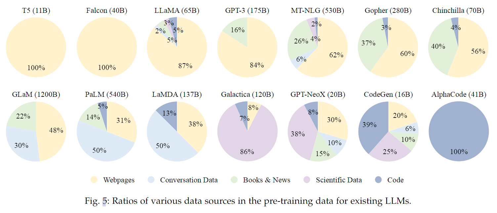
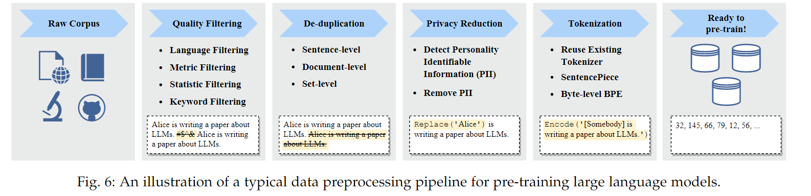
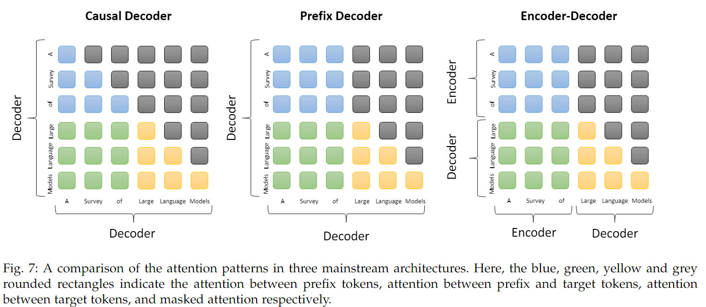
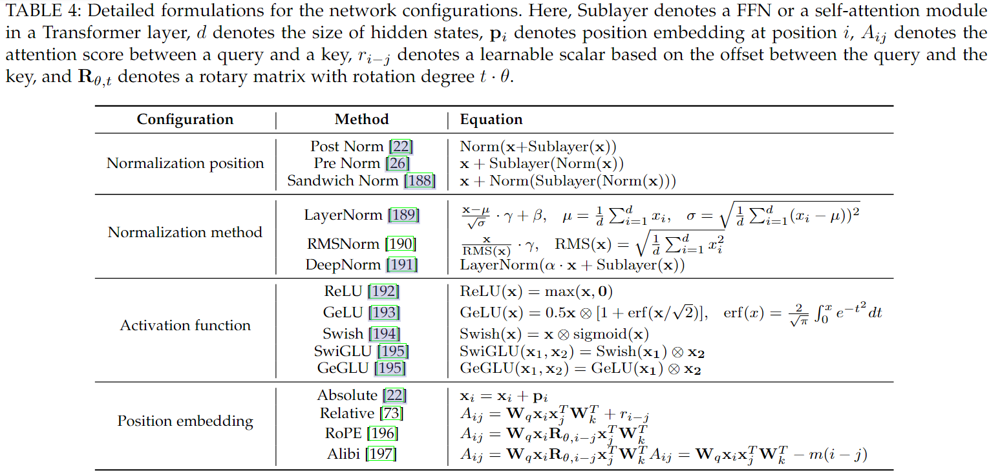
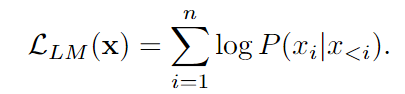
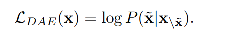
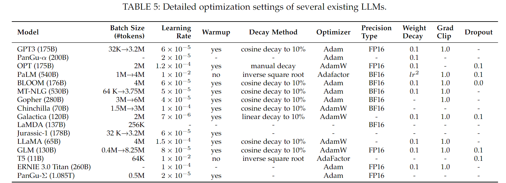

！！！这行不要删：请保留两级目录，使用（##）和（###）开头。

## 预训练

预训练是LLMs获取强大能力的基础。由于LLMs的预训练过程通常具有资源成本耗费巨大，训练时间长等特点，所以如何更有效率地完成模型的预训练过程显得十分重要，其中涉及到很多因素如数据的收集与处理、模型结构的选择、训练技巧等。下面将围绕这些因素进行介绍。

### 数据收集

现有的LLMs所用语料可大概分为两部分：通用数据（General data）和专业数据（Specialized data）。通用数据可以增强LLMs的语言建模能力和泛化能力，而专业数据则有助于增强LLMs在特定任务上的表现。

通用数据大致分为三部分：

1. Webpages:包含来自互联网上的各种数据，但所得到的数据质量良莠不齐，需要进一步的数据清洗。
2. Conversation text:其有助于增强LLMs在对话或者问答领域的能力。在具体处理中由于对话数据通常涉及到多个参与者，所以将其划分为多个子对话进行使用。一些研究发现过度使用对话数据可能使得LLMs错误地将一些陈述性指令和直接疑问句视为开头，从而影响指令（instruction）的效果。
3. Books:与上述两种语料相比，其包含了更多的长文本，有助于LLMs获得更多的语言知识，增强连贯文本的生成能力。常用数据集有Books3、Bookcorpus2。

具体数据也大致分为三部分：

1. Multilingual text:多语言文本的使用有助于增强LLMs的多语言理解与生成能力，有助于LLMs更好的处理多语言任务如文本翻译，多语问答等。
2. Scientific text:其有助于增强LLMs在科学领域的表现以及推理能力。现有的一些语料库通常从arXiv、科学书籍等相关领域上收集数据。但值得注意的是，这些数据通常有各自领域的表达格式，在使用时需要将其转换为模型能够处理的格式。
3. Code:其有助于增强LLMs的推理能力。现有数据主要从编程问答社区如Stack Exchange和GitHub上进行收集。

经过研究证明，不同种类数据的混合使用有助于增强LLMs的泛化性能；不同种类数据所用的比例影响着LLMs在不同领域的效果；所用预训练数据是否满足LLMs的需求对最终的效果有很大影响。

### 数据预处理

预训练过程中所用语料的质量对所得LLMs最终的效果有着显著的影响，因而数据的预处理显得十分重要，其主要过程如下图所示。

本小节对其中的各个过程进行介绍。

- 质量过滤

所用方法主要可分为两类：

1. classifier-based approaches:通过预先训练一个分类器来对文本的质量进行评测（如二分类下直接将文本分为高质量与低质量两类）。但一些研究发现，该方法可能会导致方言、口语类数据的减少，最终导致在整体语料中出现偏差以及多样性的降低。

2. heuristic-based approaches:通过预先设计一些规则来消除低质量文本。比如根据具体指标文本的困惑度（Perplexity）来测定文本的质量、对一些关键词进行过滤等。采用该方法的有BLOOM，Gopher等。

- 去重

研究发现文本中的重复数据可能会导致训练过程的不稳定，从而影响模型的效果，所以需要对预训练语料进行去重。可从三个层面上进行：

1. Sentence-level:直接去除那些包含重复单词或者短语的句子。
2. Document-level:现有一些去重方法主要是通过测量不同文档间一些特征（如单词）的重复率来进行去重。
3. Dataset-level:如避免训练集和验证集中数据的重复。

- 隐私保护

为了避免所用语料中出现个人隐私泄露的问题，需要对其中涉及到的个人信息进行消除，通常使用rule-based methods如直接对name、addresses等信息进行过滤。

- 分词

Tokenization将原始文本转化为token序列从而作为LLMs的输入。尽管使用现有一些分词方法如BPE、Wordpiece等能够取得一定的效果，但也有很多LLMs根据自身所用语料定制化训练分词器（tokenizer）以适配所用数据，但在后续使用时要注意训练分词器所用语料的语言与特定任务中数据语言存在差异时所带来的影响。

### 主流模型结构

无可质疑的是，Transformer仍是LLMs的backbone，但依据结构上的差异，可以将现有的主流结构分为三类：

1. Encoder-decoder Architecture:

   即原始Transfomer中使用的架构，具体内容可参考第三章的介绍。迄今为止，使用该结构的LLMs数量很少，具体有T5,BART等。

2. Casual Decoder Architecture:

   与下面介绍的结构可被共同称为Decoder-only architectures。GPT系列模型就采用此种结构，也是目前大部分LLMs所用的结构如OPT,BLOOM,Gopher。它使用单向注意力掩码机制，从而保证输入中的token只能看到它本身和位置位于它之前的token。

3. Prefix Decoder Architectures:

   该结构在输入部分采用双向注意力，即输入间可以相互看到；但在输出时仍采用Casual Decoder中的单向注意力。在使用上，通常的做法是以现有的casual decoders为基础继续训练，比如U-PaLM就源于PaLM。

在图中我们可以通过蓝色部分很清晰的看到casual decoder和prefix decoder的不同。

在Transformer发布后，后续提出了很多方面的改进以提升模型训练的稳定性和最终效果，大体有Normalization position、Normalization method、Activation function、Position embedding等方面，涉及的细节部分这里不再介绍，在下图中针对这些内容有一个概括性的陈列。

为了获得更强的泛化和训练稳定性，在实施中建议选择 RMSNorm 进行layer normalization，将 SwiGLU 或 GeGLU 作为激活函数。此外，layer normalization 如果在嵌入层之后立即使用可能会导致性能下降。在position embedding方面，RoPE 或 ALiBi由于其在长序列上的更优表现可能是更好的选择。

由于注意力机制是上述所有基于Transformer结构的LLMs的核心，所以针对这一机制也出现了很多变种。如：

1. Sparse attention:

   由于full attention带来的是n^2^级别的计算量，所以为了减少计算量，在该种机制下，每个查询只和基于位置得到的子token序列中的token计算注意力。

2. Multi-query attention:

   它指的是在多头注意力实现中不同的heads共享相同的线性变换矩阵。代表性的LLMs有PaLM和StarCoder。

3. FlashAttention:

   与上述调整不同，该机制从IO-aware方面直接优化GPUs上注意力模块的执行速度和内存占用，其更好的利用了快速内存SRAM。其已经在Pytorch、DeepSpeed上得到了部署。

### 预训练任务

预训练过程中通常使用以下三个任务作为训练目标：

1. Language Modeling:

   该任务被广泛地应用在使用Decoder-only的LLMs的预训练中，如GPT3,PaLM。其目标是给定输入序列$x={x_1,x_2……x_n}$,基于$x_{<i}$这样一组序列以autoregressive的方式预测$x_i$。

   

   因为大多数任务都可以根据输入转换为预测问题，所以以该预训练目标得到的LLMs有利于其以一种统一的方式解决问题。以该目标基础的一个变种任务是prefix language modeling,对应前面提到的prefix decoder architectures的LLMs，在这样的方式下计算损失时，不会考虑prefix部分。

2. Denoising Autoencoding:

   Denoising autoencoding task(DAE)将输入x中的$\tilde{x}$随机替换，其目标就是恢复被替换的内容$\tilde{x}$。但在实际应用中，由于该任务相对LM task更为复杂，作为预训练目标没有被广泛地使用。现有的LLMs中T5,GLM-130B以DAE作为训练目标。

   

3. Mixture-of-Denoisers：

   Mixture-of-Denoisers（MoD）也被称之为UL2损失，是一种用于预训练的统一目标，它将LM和 DAE这两种任务的目标视为不同类型的去噪任务，即S-denoiser（LM）、R-denoiser（DAE，短跨度和低程度的噪声）和X-denoiser（DAE，长跨度或高程度的噪声）。MoD在PaLM2中得到了应用。

模型结构和预训练目标的不同选择会带来不同的归纳偏差（inductive bias）,从而影响LLMs最终的效果。本节介绍有关方面的两个开放性讨论。

1. 在模型结构选择方面，casual decoder architecture仍是主流选择，但至今没有足够有力的理论以给出证明。有一些观点认为，这种结构能够在zero-shot和few-shot上实现比较好的效果，研究证明在不经过多任务微调的情况下，以这种结构预训练得到的LLMs相较其他结构有更好的zero-shot效果。此外，在下文中介绍的instruction tuing和alignment tuing已经被证明能够进一步增强使用casual decoder architecture的LLMs的能力；同时scaling law在casual decoder models上得到了证实，但与此同时将encoder-decoder model扩展到大规模上进行的研究还不足。

2. 在长文本方面，由于Transformer本身计算上带来的限制，导致模型可处理的文本长度受到很大的限制。现在GPT-4的上下文窗口（context window）能够处理32k个token。针对这一问题，有两个重要的因素需要考虑。

   一个是Extrapolation capability，指的是模型在处理超出其训练数据范围之外的输入时的能力。它衡量了模型是否能够在未见过的情况下进行准确的预测或生成，体现着模型的泛化能力。

   另一个是Efficiency，即进一步提升计算效率，如前文提到的sparse attention、FlashAttention等。

### 优化设置

在优化方面，我们简单介绍以下几个方面：

1. Batch Training:

   现有的一些实验结果表明batch size的动态调整有助于增强LLMs训练过程的稳定，例如在GPT-3中batch size从32K逐步增加到3.2M。

2. Learning Rate：

   现有的LLMs在训练中通常采用warm-up和decay strategies。具体来说，在初始 0.1% 到 0.5% 的训练步骤中，采用一种linear warm-up的方式将学习率逐渐增加到最大值，范围从大约 5 × 10−5 到 1 × 10−4（如GPT-3 是 6 × 10−5）。然后，后续步骤中采用余弦衰减策略，将学习率逐渐降低到其最大值的大约 10%，直到训练损失的收敛。

3. Optimizer:

   通常采用Adam和AdamW作为optimizer（如GPT-3），参数设置：$\beta_1$=0.9，$\beta_2$=0.95,$\epsilon$=$10^{-8}$；也有一些采用Adafactor作为optimizier（如PaLM和T5），参数设置：$\beta_1$=0.9，$\beta_2$=$1.0-k^{-0.8}$,k为training steps的数目。

4. Stabilizing the Training：

   为了尽可能避免训练过程中出现instability issue，通常采用weight decay(rate一般为0.1)和gradient clipping(threshold一般为1.0)的方式。但随着模型规模的加大，训练损失会出现波动，所以一些LLMs如PaLM和OPT在问题出现后从最近的checkpoint重新开始训练并跳过那些可能造成问题的数据。

### 可扩展训练技术

随着模型规模和数据量的加大，如何在已有计算资源的前提下尽量更有效率地完成预训练过程显得十分重要。本节介绍一些常用的方法。

1. 3D Parallelism：

   是Data parallelism，Pipline parallelism，Tensor parallelism的统称。

   Data parallelism在多个 GPU 上复制模型参数和优化器状态，然后将整个训练语料库分发给这些 GPU。这样，每个 GPU 只需要处理为其分配的数据，并执行前向和后向传播以获得梯度，然后进一步聚合不同 GPU 上计算的梯度以获得整个批次的梯度，以更新所有 GPU 中的模型。通过这种方式，能够通过增加 GPU 的数量以提高训练吞吐量。

   Pipline parallelism旨在将LLM的不同层分布到多个GPU中。特别是，在使用 Transformer 模型的情况下，它将连续的层加载到同一个 GPU 上，以降低在 GPU 之间传输计算的隐藏状态或梯度的成本。但一个可能的问题是，这样会导致较低的GPU利用率，因为每个GPU必须等待前一个GPU完成计算。为了缓解这一问题，GPipe和PipeDream提出填充多批数据和异步梯度更新的技术。

   与Pipline parallelism不同，Tensor parallelism侧重于分解 LLM 中的Tensor（即参数矩阵）。对于LLM中的矩阵乘法操作Y = XA，参数矩阵A可以按列分成两个子矩阵A1和A2，进而表示为Y = [XA1, XA2]。通过在不同的 GPU 上放置矩阵 A1 和 A2，矩阵乘法操作将在两个 GPU 上并行调用，并且可以通过跨 GPU 通信组合两个 GPU 的输出来获得最终结果。

   在具体使用中，通常将这三种方式结合使用。

2. ZeRO:

   该技术由Deip-Speed提出，为了解决Data parallelism中存在的内存冗余问题。如前所述，Data parallelism要求每个 GPU 存储 LLM 状态的副本，包括模型参数、模型梯度和优化器参数。然而，并非所有上述数据都需要在每个 GPU 上保留。ZeRO 技术旨在每个 GPU 上只保留一小部分数据，而在需要时可以从其他 GPU 中检索其余数据。具体来说，ZeRO 提供了三个解决方案，具体取决于数据的三部分如何存储，即optimizer state partitioning, gradient partitioning, and parameter partitioning。实验表明前面两部分并未增加通信开销，而第三部分虽然增加了大约50%的通信开销但同时节省了与GPU数量成比例的内存。

3. Mixed Precision Training:

   在早期通常使用FP32的数据格式，后来开始使用FP16格式以减少内存使用和通信开销，但一些研究发现FP16可能会导致精度上的损失从而影响模型的最终效果。为了缓解该问题，后续有研究者使用Brain Floating Point(BF16)用于训练。

由于LLM的训练是一个时间成本和资源成本都耗费巨大的过程，所以如何在早期阶段对模型未来的效果进行预测以及检测训练过程中的问题变得很重要（比如GPT-4引入了一种新的机制，称为建立在深度学习堆栈上的predictable scaling，从而能够使用更小的模型预测LLM的效果）。

## 大模型的使用

### In-Context Learning

ICL的形式如上图，由三个部分组成：任务描述，若干个问答的示例（demonstration）和一个query

ICL与前文提及的指令微调，都采用了自然语言的形式来描述任务和实例，区别在于后者是为了适配模型，前者仅在使用阶段提示LLM

ICL的性能很大程度上依赖于示例，所以设计合适的示例至关重要，这包含以下三个方面：
- 示例选择：通常采用简单且低开销的启发式方法，比如基于k-NN检索与query语义相关的示例、选择最具代表性的示例集合

- 示例格式：一些研究考虑添加任务描述，或者通过 CoT 提示来构建模板

- 示例顺序：LLM会倾向于重复示范结尾的答案 。早期工作提出了一些启发式方法来快速地找到一个良好的顺序

关于LLM如何实现ICL：
- 一种观点认为，LLM主要是从示例中识别出目标任务而非从中学习。也就是说，LLM从示例中识别出目标任务后，利用预训练中获得的先验知识来解决新任务。相关研究认为，在预训练数据中存在一个代表任务的潜在变量，LLM能够从示例中捕获这个变量，使它们能够在ICL中识别任务。

- 另一种观点认为，LLM仅仅通过示例来学习在预训练阶段没有见过的新任务。因为任务识别的能力在小型LM中也能体现，而只有LLM才能涌现任务学习的能力。同时一些研究表明，小型LM倾向于忽略标签，主要依靠其先验知识来完成任务，而LLM有能力超越其先验知识，并从示例中获取新知识，从而获得更好的结果。

  

### Chain-of-Thought Prompting
CoT是一种改进的Prompting，主要用于复杂推理任务中。我们通常在ICL中使用CoT。
- Few-shot CoT：是ICL的一种特例，即CoT在输入输出之间额外包含了中间推理步骤。一种直接的方法是使用多样的推理路径，通过这些答案得到最一致的答案。另一个基于直觉的想法是，具有复杂推理路径的提示更有可能引出 LLM 的推理能力，这可以提高生成正确答案的准确性。
- Zero-shot CoT：即，在提示中不包含人类标注的示例。比如，简单地使用“Let’s think step by step”提示 LLM 来生成推理步骤，然后通过“Therefore, the answer is”来得出最终答案。

CoT何时适用于LLM?
CoT是大模型中的一种涌现能力，通常用于需要逐步推理的任务，而在一些简单任务中反而没有标准提示的效果好。

LLM为何能有CoT?
由于在代码数据中训练的模型具有强大的推理能力，所以通常认为CoT的能力也源于此，但这并未得到充分实验证明。另外，有实验表明，在非 CoT 数据上进行指令微调不会提高模型使用 CoT 完成任务的性能，所以这也不是CoT的关键因素。
有研究表明，模式（比如算术推理的公式）和文本较为重要，而符号（比如算术推理的数值量）和模式的正确性却不重要，并且文本和模式是相互促进的。

### Planning for Complex Task Solving
ICL和CoT都是在各种任务上比较通用的方法，缺陷在于难以解决数学推理这种复杂任务，为此提出基于提示的Planning方法，将一个复杂任务拆分为多个子任务，并生成完成任务的行动计划，逐一解决这些任务。

整体框架如下图，由LLM理解目标任务后生成计划（既可以是自然语言的行动序列，也可以是编程语言的可执行程序），Executor（LLM或机器人）在环境中执行计划，环境把关于行动结果的反馈（自然语言或其他模态的信号）返回LLM，从而让LLM改善计划，不断重复此过程以得到更好的结果。

### Prompt设计指南
Prompting是使用LLM的主要方法，而prompts的质量在很大程度上影响LLM在特定任务的性能，接下来让我们看看如何设计合适的Prompts

Prompts包含了四个关键要素：
- task description：用自然语言的形式描述任务目标，我们需要进一步使用关键词强调特殊设置（比如特别的输入输出格式）来引导LLM
- input data：通常我们可以直接以自然语言的形式描述输入数据，而对于知识图和表格等结构化数据，我们通常线性化为序列。另外，编程语言的可执行代码也可用于形式化这些数据
- contextual information：例如，检索到的文档对于开放域问答非常有用，可以作为支持证据。因此，它需要以适当的提示模式或表达式格式包含这些信息。此外，上下文任务示例也有助于激发llm完成复杂任务，它可以更好地描述任务目标、特殊的输出格式以及输入和输出之间的映射关系。
- prompt style：prompt应该表达为清晰的问题和详细的指令。有时添加前缀和后缀可以更好地引导LLM，比如添加前缀“Let us think step by step”或“You are an expert on this task（or in this domain）”。另外，对于chat-based的LLM（比如ChatGPT），比起直接输入冗长且复杂的prompt，把它分解为与子任务对应的多个prompt，以多轮对话的形式输入LLM，可能有更好的效果。

一些设计原则如下：
- 我们需要清楚地表达任务目标，如Given a long document, I want you to generate a concise summary，并说清楚条件限制，如the length of the summary cannot exceed 50
- 尽量划分为简单的子任务，如Braid a coherent narrative by performing the following tasks: 1. ...; 2. ...; 3. ...
- 提供少量高质量的示例
- 使用模型友好的格式：在OpenAI文档中建议使用###或"""分离指令和上下文，可以更好地被LLM理解
- 复杂任务中有特定的输出形式或背景知识，prompt显得更为重要，能达到与监督方法相当或更好的性能。如数学推理任务，可以基于编程语言的形式设计prompt

## 参考

[[1]](https://github.com/RUCAIBox/LLMSurvey) 大语言模型综述
